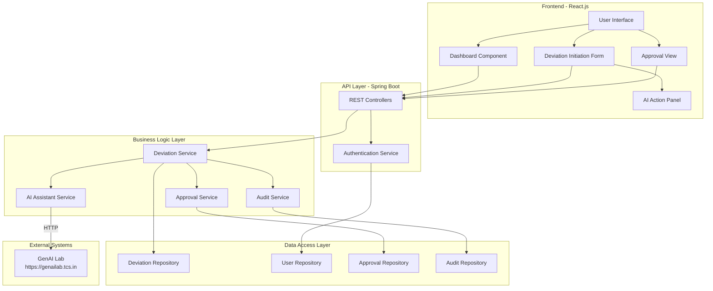
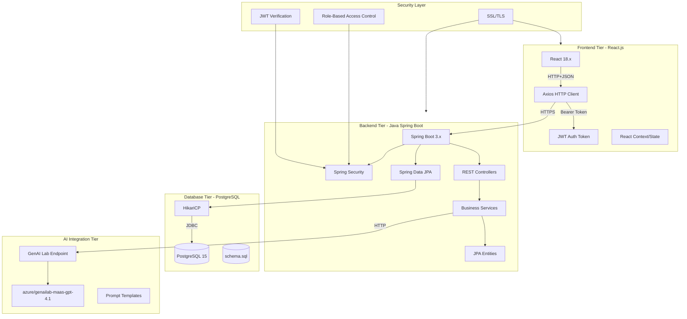
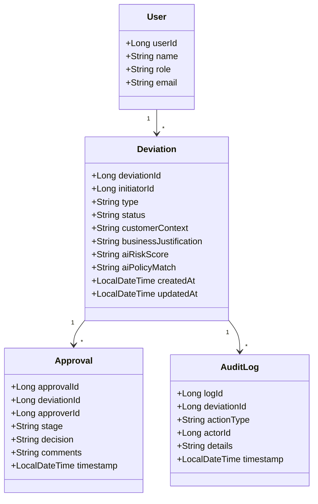
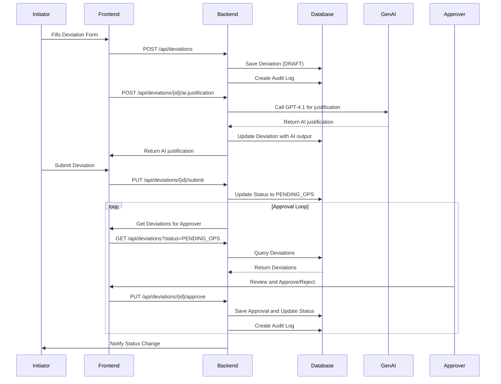
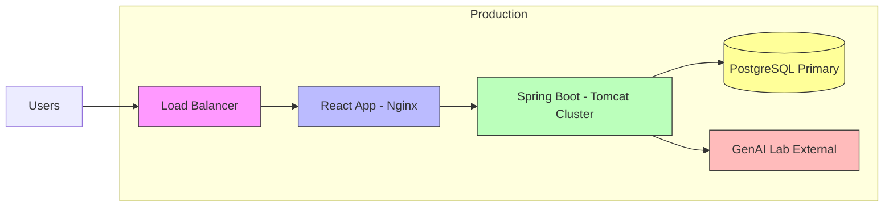

# Architecture Diagrams
## AI-Assisted Service Deviation & Approval Workflow

---

## 1. Application Architecture Diagram

---

## 2. Technical Architecture Diagram

---

## 3. Component Architecture Diagram

---

## 4. Workflow Sequence Diagram

---

## 5. Deployment Architecture

