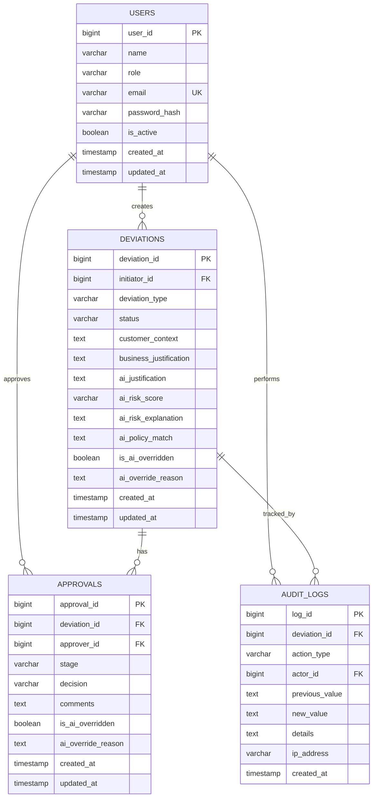

# Entity-Relationship (ER) Diagram
## AI-Assisted Service Deviation & Approval Workflow

## Relationship Cardinalities

| Relationship | Type | Description |
|-------------|------|-------------|
| USERS → DEVIATIONS | One-to-Many | A user can create multiple deviations |
| USERS → APPROVALS | One-to-Many | An approver can approve multiple deviations |
| DEVIATIONS → APPROVALS | One-to-Many | A deviation can have multiple approval stages |
| USERS → AUDIT_LOGS | One-to-Many | A user can perform multiple actions logged |
| DEVIATIONS → AUDIT_LOGS | One-to-Many | A deviation has multiple audit entries |